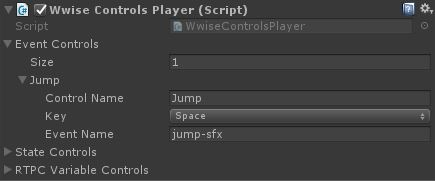
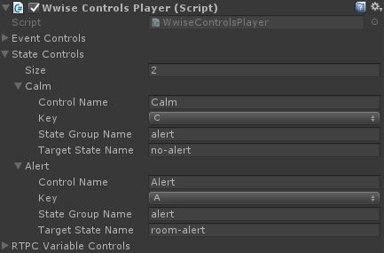
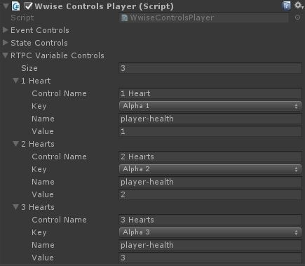

# Muffin Tools Docs - `WwiseControlsPlayer`

Utility component for testing Wwise events.

## Usage

Add the `WwiseControlsPlayer` component by clicking on *Add Component* button in the Inspector > Muffin Tools > Dependencies > Wwise > Wwise Controls Player.

With Wwise audio engine, you can have several types of events to trigger in order to trigger music, sounds and effects. This utility component allows you to map some of them for inputs. You can set inputs for:

- Events
- States
- RTPC variables

In each of these arrays, you'll have to define:

- a **control name**: simply the display name of the control in the inspector
- a **key**: the input to bind to trigger this control

Then, each type of event has its own properties.

### Simple events

- **Event name**: name of the event to trigger in Wwise

### State change

- **State group name**: name of the state group in Wwise
- **Target state name**: name of the target state in the state group

### RTPC variable

- **Name**: name of the RTPC variable Wwise
- **Value**: target value of the variable