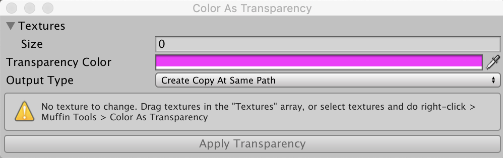

# Muffin Tools Docs - Tools - Color As Transparency

Converts selected textures' pixels into transparent one.

This tool allows you to define a color on your textures or sprites that should be converted into transparent pixels, and choose to replace the existing files or create new ones.

## Usage

Open the tool window by clicking on *Muffin Tools > Color As Transparency*.

You can also select at least one texture or sprite in your assets, and do *right-click > Muffin Tools > Color As Transparency*.

Put your textures in the *Textures* array, and select the color that will be convert to transparent.

The *Output Type* field let you define how new textures are saved:

* ***Replace Assets***: Replace the original files
* ***Create Copy At Same Path***: Creates a new file at the original textures' path
* ***Custom Output Path***: Allows you to define the path of the generated textures

When you're ready, click "Apply Transparency", done!