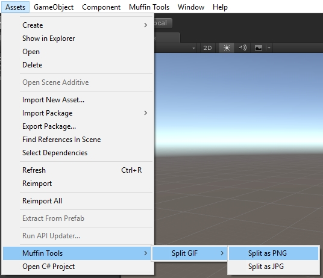
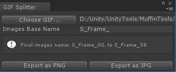

# Muffin Tools Docs - Tools - GIF Splitter

Extracts frames of a GIF, and exports them in JPG or PNG format, so they can be used as textures or sprites in Unity projects.

## Usage

There's two ways to use this tool: by selecting a GIF imported in your project and going to *Assets > Muffin Tools > Split GIF*, or by using the utility window for splitting GIF out of the project.

### From imported GIFs

If you have a GIF imported in your project, right-click on it (or select it and click on *Assets" menu), and go to *Muffin Tools > Split GIF*, then select the target format of the GIF's frames (JPG or PNG).

A popup will invite you to select the folder where the GIF's frames will be exported. Select the folder, and click on "Select folder" button.

Done!

### From utility window

You can use this method to extract frames of a GIF that is not imported in your project.

To open that window, click on *Muffin Tools > GIF Splitter* in main menus. Note that the opened window can be docked anywhere in Unity UI.

To extract a GIF's frame, follow these steps:

1. Click on "Choose GIF..." button to select the GIF to extract
2. Spcify the base name of each frame in the "Image Base Name" field
3. Click on "Export as PNG" or "Export as JPG" button to choose the target format
4. Select the target folder of the extracted frames
5. Done!

Note that extracted frames are named using the specified "Image Base Name", and the id of the frame. For example, for a GIF of 3 frames, if you set the base name "Frame_" and export them as PNG, you'll get 3 files:

* Frame_1.png
* Frame_2.png
* Frame_3.png