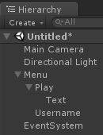
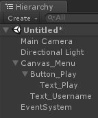

# Muffin Tools Docs - Tools - UI Elements Renamer

Tool for renaming Game Objects in Canvas.

## Usage

This plugin provides new context menu in the *Hierarchy* view.

To try this tool, create a new scene and follow these steps:

* Open a new scene
* Add a canvas GameObject from *GameObject > UI > Canvas*
* Name the canvas "Menu"
* Add a button GameObject from *GameObject > UI > Button*
* Name the button "Play"
* Add a text GameObject from *GameObject > UI > Text*
* Name the text "Username"

You should have this in you *Hierarchy* view:



Right-click on "Menu" canvas, and click on *Muffin Tools > UI > Rename UI Elements*.

Now, check your *Hierarchy* view, with elements renamed:



## Nomenclature

Each child element from the selected one (the one you right-click on) will be renamed with this format:

```txt
ElementType_Name
```

For example, for an image named "Avatar", you'll get `Image_Avatar`, etc.

Note that if a button or any other object that has children elements, the name of the parent element will be use (except for children renamed manually). So in the example above, you can see that the button "Play" has been renamed `Button_Play`, and its child "Text" has also been renamed `Text_Play`.

## Demo

You can try this tool in the demo scene of the package in *MuffinTools/Tools/Editor/Nomenclature/Demos/RenameUIElements*. This demo scene contains all possible UI elements, so you can check the tool's behaviour on each one.