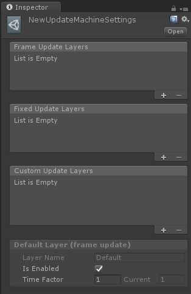
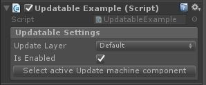

# Muffin Tools Docs - Update Machine

This tool allows you to manage Unity updates order, creates your custom update layers, and also manage pause.

## Getting started

Here is some steps to follow in order to use start using *Update Machine* quickly. You will find more details below, in *How to use?* part.

Create a new `UpdateMachineSettings` asset by clicking on *Assets > Create > Muffin Tools > Update Machine Settings*. This asset contains all the *Update Machine* layers that your "updatable" components can use. For this example, create a new layer "Player" in "Frame Update layers" list, by clicking on the "+" icon:


Create a new empty `GameObject` in your scene, and attach the `Update Machine` component to it in *Add Component > Muffin Tools > Update Machine > Update Machine*.

Place the `UpdateMachineSettings` asset you created earlier in the "Update Machine Settings" field. Note that you can click on the arrow on the left of the field to directly edit the asset from the component.

**IMPORTANT**: `Update Machine` component works as a singleton. So you must have one and only one instance in your scene in order to use *Update Machine*.


Now we will make a component that can be updated by *Update Machine* (called an "updatable" in the system logic). To do so, create a new C# Script, and make it inherit from `Updatable` class.

The `Updatable` class inherits from `IUpdatable` (required to work with *Update Machine*), and already contains informations about layer setup. All you have to do now is to override the `OnUpdate()` method, which is called when the updatable's layer is updated.

```cs
using UnityEngine;
using MuffinTools.UpdateMachine;
public class UpdateMachineTester : Updatable
{
    public override void OnUpdate(float deltaTime, float factor)
    {
        Debug.Log("Updated!");
    }
}
```

Place your brand new component on a `GameObject` in the scene, and take a look to the inspector. The "updatable settings" property of `Updatable` allows you to setup the layer of this updatable. Select "Player" in the "layer name" field, and run the game.


You can see the "Updated!" log in console, every frame. Congratulations, you now know how to use the *Update Machine*! Try to make new layers in the `UpdateMachineSettings` asset (or directly from the `Udpate Machine` component) or change these settings at runtime, and see what happens!

## How to use?

The *Update Machine* system is based on "layers" that you can create and place in the order you want. There's 3 categories of layers":

- **Frame update layer**: updated on Unity's `Update()` message
- **Fixed update layer**: updated on Unity's `FixedUpdate()` message
- **Custom update layer**: updated on Unity's `Update()` message, but only trigger `OnUpdate()` event after a given amount of time


Each layer has a name, an "enabled" state, and a time factor. For frame and fixed udpate layers, the time factor is just a multiplier that you can use as you wish (these layers are updated on `Update()` and `FixedUpdate()` messages anyway). For custom update layers, it multiplies `OnUpdate()` calls intervals automatically.

Note that custom update layers also have a "custom update time" setting, that allows you to define the interval between two `OnUpdate()` calls.

[=> More informations about `UpdateMachineLayer` class](./update-machine-layer.md)

### 1. Setup layers

In order to setup layers, you need to create an `UpdatableMachineSettings` asset, that contains informations about layers of all categories. To do so, click on *Assets > Create > Muffin Tools > Update Machine Settings*.



You can add or remove layers in all categories by clicking on "+" or "-" icons of each list. When adding a layer, it will have a default name and default settings. In edit mode, you won't be able to define the "current" field (which is the current time factor of the layer), because it doesn't make sense. In play mode, you can change this value, without changing the "default" time factor of the layer (the "time factor" field).

You can create as much layers as you need, there's no limit. But all layers must have a different name. If a layer has an empty name or the same name as another layer, you'll see a warning icon on the left of the "layer name" field. This restriction is because, at runtime, the updatables are placed on their layers by a selected layer name.

**IMPORTANT**: If the layer of an updatable doesn't exist, it will be placed on the default layer. If there's two or more layer with the same name, only the first one of all categories will be used.

[=> More informations about `UpdatableMachineSettings` class](./update-machine-settings.md)

### 2. Run Update Machine

You must place an `Update Machine` component in the scene. This component will update all layers contained in the `UpdateMachineSettings` asset you set on it.

**IMPORTANT**: `Update Machine` component works as a singleton. So you must have one and only one instance in your scene in order to use *Update Machine*.

Note that you can click on the arrow on the left of the field to edit the `UpdateMachineSettings` asset directly from the component.


[=> More informations about `UpdatableMachine` component](./update-machine.md)

### 3. Make "*updatables*" components

In *Update Machine* logic, components that uses the system are called "*udpatables*".

There's 2 ways to make an updatable:

- Make it yourself by implementing the `IUpdatable` interface
- Inherit from `Updatable` class, which is a shortcut that already implements `IUpdatable` interface

#### Implement the `IUpdatable` interface

The `IUpdatable` interface forces you to override `OnUpdate()` method, which is called by the layers when they're updated, and also have an `UpdatableSettings` property accessor.

Note that an `UpdatableSettings` property contains informations about a layer to use, and an "enabled" state. It also has a custom property drawer, so a serialized property of this type will have a specific inspector field, that allows you to select a layer from a context menu.



Example script:

```cs
using UnityEngine;
using MuffinTools.UpdateMachine;

public class UpdatableExample : MonoBehaviour, IUpdatable
{
    // Contains informations about the update layer
    [SerializeField]
    private UpdatableSettings m_UpdatableSettings = new UpdatableSettings();

    private void OnEnable()
    {
        UpdateMachine.AddUpdatable(this);
    }

    private void OnDisable()
    {
        UpdateMachine.RemoveUpdatable(this);
    }

    public void OnUpdate(float _DeltaTime, float _Factor)
    {
        Debug.LogFormat
        (
            "Update layer {0} (deltaTime = {1}, factor = {2}, update time = {3})",
            m_UpdatableSettings.UpdateLayer,
            _DeltaTime,
            _Factor,
            UpdateMachine.Settings.GetLayerUpdateTime(m_UpdatableSettings.UpdateLayer)
        );
    }

    public UpdatableSettings UpdatableSettings
    {
        get { return m_UpdatableSettings; }
    }
}
```

You need to make the *Update Machine* aware of this component manually. In the example script, this is done in `OnEnable()` and `OnDisable()` messages, by using `UpdateMachine.AddUpdatable()` and `UpdateMachine.RemoveUpdatable()` methods.

When calling `UpdateMachine.AddUpdatable()`, the *Update Machine* system will assing the updatable to the appropriate layer using its `UpdatableSettings`.

Note that chaning the layer of an updatable at runtime won't really change it. If you need to do it, you can use `UpdateMachine.ChangeUpdatableLayer()` method.

[=> More informations about `UpdatableSettings` class](./updatable-settings.md)
[=> More informations about `IUpdatable` interface](./i-updatable.md)
[=> More informations about `UpdateMachine` component](./update-machine.md)

#### Using the `Updatable` shortcut

If your script doesn't need to inherit from another class than `MonoBehaviour` but has to use *Update Machine*, you can just inherit from `Updatable` class.

This class implements `IUpdatable` interface for you, and all you have to do left is override `OnUpdate()` method to act on layer updates.

Example script:

```cs
using UnityEngine;
using MuffinTools.UpdateMachine;

public class UpdatableExample : Updatable
{
    public void OnUpdate(float _DeltaTime, float _Factor)
    {
        Debug.Log("Updated!");
    }
}
```

[=> More informations about `Updatable` class](./updatable.md)
[=> More informations about `IUpdatable` interface](./i-updatable.md)

## Summary

- [`EUpdateMachineTime`](./e-update-machine-type.md): Enumerations of *Update Machine* layer types
- [`IUpdatable`](./i-updatable.md): Interface for making *Update Machine* aware of a component
- [`Updatable`](./updatable.md): Abstract component class, shortcut to make an *Update Machine*-dependant component
- [`UpdatableSettings`](./updatable-settings.md): Contains the settings for an updatable component (layer's name and enable state)
- [`UpdateMachine`](./update-machine.md): Main component of *Update Machine* system. Contains the `UpdateMachineSettings` asset to use, and updates all layers at runtime
- [`UpdateMachineLayer`](./update-machine-layer.md): Contains informations about a layer, and also all its updatables to update at runtime
- [`UpdateMachineSettings`](./update-machine-settings.md): Asset that contains all layers, by layer type

### Editor

- [`UpdatablesSettingsDrawer`](./Editor/updatable-settings-drawer.md): Property drawer for `UpdatableSettings`, allowing you to selct udpate layer of a component using a proper context menu
- [`UpdateMachineEditor`](./Editor/update-machine-editor.md): Custom editor for `UpdateMachine` component
- [`UpdateMachineSettingsEditor`](./Editor/update-machine-settings-editor.md): Custom editor for `UpdateMachineSettings` asset