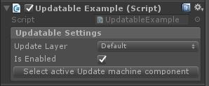

# Muffin Tools Docs - `UpdatableSettings`

Contains the settings for an updatable component (layer's name and enable state).

Any updatable with a serialized property of this type will get a specific field in the inspector, allowing you to select the layer to use:



## Accessors

```cs
public string UpdateLayer { get; }
```

Gets the name of the target layer.

---

```cs
public bool Enabled { get; }
```

Checks if this updatable is enabled.