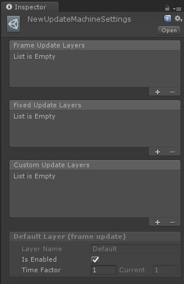

# Muffin Tools Docs - `UpdateMachineSettings`

Asset that contains all layers, by layer type.



## Usage

You must set an asset of this type on an `UpdateMachine` component. To create one, click on *Assets > Create > Muffin Tools > Update Machine Settings*.

Layer types:

- **Frame update layers**: updated at each `Update()` Unity message
- **Fixed udpate layers**: updated at each `FixedUpdate()` Unity message
- **Custom update layers**: updated each interval you set, using "custom update time" field on layer settings

To add a layer in a any category, click on "+" icon of a list. To remove it, select it and click on "-" icon.

[=> More informations about layer settings](./update-machine-layer.jpg)

## Methods

```cs
public void UpdateLayers(EUpdateLayerType _UpdateTime, float _DeltaTime)
```

Update all layrs of the given update type, by given delta time.

---

```cs
public bool AddUpdatable(IUpdatable _Updatable)
```

Adds an updatable to its target layer. Note that if the updatable's target layer name doesn't exist, it will be added to the default layer.

Returns true if the updatable has successfully been added to a layer, otherwise false.

---

```cs
public bool RemoveUpdatable(IUpdatable _Updatable)
```

Removes the given updatable from its layer.

Returns true if the updatable has successfully been removed from a layer, otherwise false.

---

```cs
public bool ChangeUpdatableLayer(IUpdatable _Updatable, string _TargetLayerName)
```

Removes the given updatable from its layer, then adds it to the given target layer.

Returns true if the operation is successful, otherwise false.

---

```cs
public void ResetLayers()
```

Removes updatables on all layers, and rests their time factor.

---

```cs
public void ResetLayersTimeFactor()
```

Resets all layers time factor.

---

```cs
public void ClearAllUpdatables()
```

Removes updatables on all layers.

## Accessors

```cs
public UpdateMachineLayer GetLayer(string _LayerName)
```

Gets the named layer if it exists.

Returns the named layer, or the default layer if it doesn't exist. Note that because of that behaviour, the returned value cannot be null

---

```cs
public float GetLayerUpdateTime(string _LayerName)
```

Gets the update time of the named layer.

Returns the named layer's update time, or the default layer's if it doesn't exist.

---

```cs
public IUpdatable[] GetAllUpdatables()
```

Gets updatables on all layers.

---

```cs
public Dictionary<EUpdateLayerType, List<string>> LayerNamesByUpdateType { get; }
```

Gets lists of layers names, by update type. This method is used by custom editor class for drawing a proper context menu.

---

```cs
public string[] LayerNames { get; }
```

Gets all layer names as an array.

---

```cs
public UpdateMachineLayer DefaultLayer { get; }
```

Initializes the default layer if it doesn't exist, and returns it.